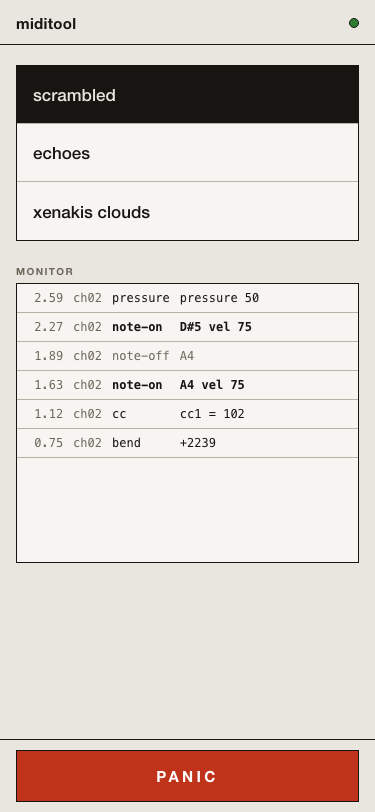
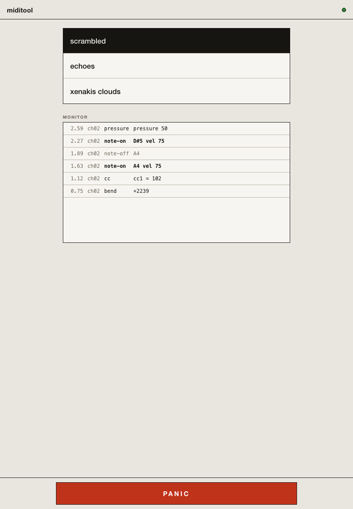
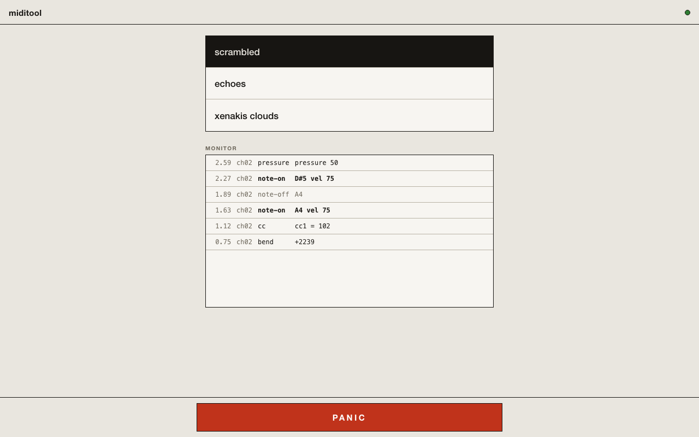

The remote is a web page miditool serves on your local network: scene switching, a live event monitor, and a panic button, sized for a phone on a music stand. No app, no account, no cloud.

## Turn it on

Add a `remote` node to the config:

```kdl title="miditool.kdl"
input "Roland"
remote port=8320 bind="0.0.0.0"

scene "scrambled" {
    shuffle-lock seed=42
}
scene "echoes" {
    echo repeats=4 time="300ms" decay=0.7
}
```

`bind="0.0.0.0"` opens the remote to your local network, which is what a phone on a music stand needs. Without it the remote binds loopback and answers this machine only, so turning it on never exposes anything by accident.

Run miditool, then open the remote from any phone, tablet, or laptop **on the same network**:

```text
http://<your-computer>.local:8320     e.g. http://studio-mac.local:8320
http://<LAN-IP>:8320                  e.g. http://192.168.1.20:8320
```

## Finding your computer's address

- **macOS**: the `.local` name is your computer's name from System Settings, General, Sharing (shown at the bottom). For the numeric address, run `ipconfig getifaddr en0`.
- **Linux**: `hostname -I` prints the LAN IP; many distributions also answer at `<hostname>.local` via Avahi.
- **Windows**: run `ipconfig` and use the IPv4 Address of your active adapter.

The remote never serves beyond your local network. It is a plain HTTP server; with `bind="0.0.0.0"` it answers your machine's LAN interfaces, nothing leaves your network, and nothing on the internet can reach it. Omit `bind=` (or write `bind="127.0.0.1"`) to keep it reachable from this machine only.

## What the screen shows



Top to bottom:

- **Connection lamp**: green while the browser is connected to miditool, red when it is not. When the connection drops, the panel dims and reconnects on its own.
- **Scene keys**: one per `scene` block, in file order. Tap to switch; the active scene is shown inverted once miditool confirms the switch. What happens to sounding notes on a switch is the scene's `switch=` setting: see [Config files](/miditool/configuration/config-files/#scenes).
- **Monitor**: the transformed event stream as it heads to the DAW, newest first, with timestamps, channels, note names, and velocities.
- **PANIC**: releases every sounding note immediately. The press is logged on the monitor tape.

On a tablet or a laptop the layout is the same single column, centered:





## Notes

- The remote works only when the config uses `scene` blocks; with one implicit scene there is still a monitor and a panic button, just a single scene key.
- Several devices can be connected at once; they all stay in sync.
- The port is yours to choose, `1..=65535`. If another service already has it, miditool reports the conflict at startup.
